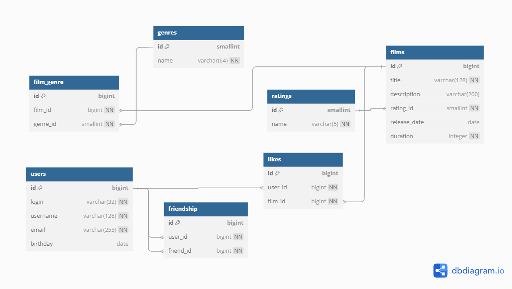

# Filmorate

Filmorate - это сервис для работы с фильмами и оценками пользователей, который возвращает топ-5 фильмов, рекомендованных к просмотру.
# База данных приложения «Кинотеатр»

## ER-диаграмма



---

## Описание таблиц

### users
Хранит данные о зарегистрированных пользователях:
- **`id`** — уникальный идентификатор пользователя (int, PK)
- **`email`** — адрес электронной почты (varchar, NOT NULL)
- **`login`** — логин для входа (varchar, NOT NULL)
- **`name`** — отображаемое имя (varchar, NOT NULL)
- **`birthday`** — дата рождения (date, NOT NULL)

### friendship_status
Справочник возможных состояний дружбы:
- **`id`** — первичный ключ записи (int, PK)
- **`code`** — код статуса (varchar, NOT NULL)
- **`name`** — наименование статуса (varchar, NOT NULL)
- **`description`** — подробное описание (varchar, NULLABLE)

### users_friendship
Связывает пользователей и их статус дружбы:
- **`id`** — PK для записи (int, PK)
- **`user_id`** — кто отправил запрос (int, FK → `users.id`)
- **`friend_id`** — кому направлен запрос (int, FK → `users.id`)
- **`status_id`** — текущий статус дружбы (int, FK → `friendship_status.id`)

### films
Содержит информацию о фильмах:
- **`id`** — PK фильма (int, PK)
- **`name`** — название фильма (varchar, NOT NULL)
- **`description`** — краткое описание (varchar, NOT NULL)
- **`release_date`** — дата премьеры (date, NOT NULL)
- **`duration`** — длительность в минутах (int, NOT NULL)
- **`mpa_rating_id`** — возрастной рейтинг (int, FK → `mpa_ratings.id`)

### films_users_likes
Запись о «лайках»:
- **`id`** — PK записи (int, PK)
- **`film_id`** — фильм, которому поставлен лайк (int, FK → `films.id`)
- **`user_id`** — пользователь, который лайкнул (int, FK → `users.id`)

### directors
Справочник режиссёров:
- **`director_id`** — PK режиссёра (long, PK)
- **`name`** — имя режиссёра (varchar, NOT NULL)

### directors_films
Связка «многие‑ко‑многим» фильм–режиссёр:
- **`film_id`** — фильм (int, FK → `films.id`)
- **`director_id`** — режиссёр (long, FK → `directors.director_id`)

### genres
Справочник жанров:
- **`id`** — PK жанра (int, PK)
- **`code`** — кодовое обозначение (varchar, NOT NULL)
- **`name`** — название жанра (varchar, NOT NULL)
- **`description`** — описание жанра (varchar, NULLABLE)

### films_genres
Связка «многие‑ко‑многим» фильм–жанр:
- **`id`** — PK записи (int, PK)
- **`film_id`** — фильм (int, FK → `films.id`)
- **`genre_id`** — жанр (int, FK → `genres.id`)

### mpa_ratings
Справочник возрастных рейтингов:
- **`id`** — PK рейтинга (int, PK)
- **`code`** — буквенный код рейтинга (varchar, NOT NULL)
- **`name`** — полное название рейтинга (varchar, NOT NULL)
- **`description`** — примечание к рейтингу (varchar, NULLABLE)

---

## Примеры SQL‑запросов

**1. Список всех фильмов**
```sql
SELECT * FROM films;
```

**2. Список всех пользователей**
```sql
SELECT * FROM users;
```

**3. Топ N популярных фильмов по количеству лайков**
```sql
SELECT f.*
FROM films AS f
LEFT JOIN films_users_likes AS ful
  ON f.id = ful.film_id
GROUP BY f.id
ORDER BY COUNT(ful.user_id) DESC
LIMIT :N;
```

**4. Список друзей заданного пользователя**
```sql
SELECT u.*
FROM users AS u
JOIN users_friendship AS uf
  ON u.id = uf.friend_id
WHERE uf.user_id = :userId
  AND uf.status_id = (
    SELECT id
    FROM friendship_status
    WHERE code = 'CONFIRMED'
  );
```

**5. Лайки конкретного пользователя**
```sql
SELECT f.*
FROM films AS f
JOIN films_users_likes AS ful
  ON f.id = ful.film_id
WHERE ful.user_id = :userId;
```

**6. Жанры определённого фильма**
```sql
SELECT g.*
FROM genres AS g
JOIN films_genres AS fg
  ON g.id = fg.genre_id
WHERE fg.film_id = :filmId;
```

**7. MPA‑рейтинг конкретного фильма**
```sql
SELECT r.*
FROM mpa_ratings AS r
JOIN films AS f
  ON r.id = f.mpa_rating_id
WHERE f.id = :filmId;
```

**8. Список всех режиссёров**
```sql
SELECT * FROM directors;
```

**9. Режиссёры определённого фильма**
```sql
SELECT d.*
FROM directors AS d
JOIN directors_films AS df
  ON d.director_id = df.director_id
WHERE df.film_id = :filmId;
```

**10. Фильмы конкретного режиссёра, отсортированные по году выпуска**
```sql
SELECT f.*
FROM films AS f
JOIN directors_films AS df
  ON f.id = df.film_id
WHERE df.director_id = :directorId
ORDER BY f.release_date;
```

**11. Фильмы конкретного режиссёра, отсортированные по количеству лайков**
```sql
SELECT f.*, COUNT(ful.user_id) AS likes_count
FROM films AS f
JOIN directors_films AS df
  ON f.id = df.film_id
LEFT JOIN films_users_likes AS ful
  ON f.id = ful.film_id
WHERE df.director_id = :directorId
GROUP BY f.id
ORDER BY likes_count DESC;
```

## Функциональности

### Фильмы:
- Добавление фильма
- Обновление информации о фильме
- Получение списка всех фильмов
- Получение топ-N популярных фильмов
- Добавление и удаление лайков
- Получение фильмов конкретного режиссёра

### Пользователи:
- Создание пользователя
- Обновление информации о пользователе
- Получение списка всех пользователей
- Управление дружбой между пользователями

### Режиссёры:
- Создание режиссёра
- Обновление информации о режиссёре
- Получение списка всех режиссёров
- Получение режиссёра по ID
- Удаление режиссёра
- Связывание режиссёров с фильмами

### Жанры:
- Получение списка всех жанров
- Получение жанра по ID

### MPA рейтинги:
- Получение списка всех MPA рейтингов
- Получение MPA рейтинга по ID

## Технологии

- Java 21
- Spring Boot
- Maven
- JUnit для тестирования
- H2 Database (для разработки)
- JDBC для работы с базой данных

## API Endpoints

### Фильмы
- `GET /films` - получение всех фильмов
- `POST /films` - добавление фильма
- `PUT /films` - обновление фильма
- `GET /films/{id}` - получение фильма по ID
- `DELETE /films/{id}` - удаление фильма
- `PUT /films/{id}/like/{userId}` - добавление лайка
- `DELETE /films/{id}/like/{userId}` - удаление лайка
- `GET /films/popular?count={count}` - получение популярных фильмов
- `GET /films/director/{directorId}?sortBy={sortBy}` - получение фильмов режиссёра

### Пользователи
- `GET /users` - получение всех пользователей
- `POST /users` - создание пользователя
- `PUT /users` - обновление пользователя
- `GET /users/{id}` - получение пользователя по ID
- `DELETE /users/{id}` - удаление пользователя
- `PUT /users/{id}/friends/{friendId}` - добавление в друзья
- `DELETE /users/{id}/friends/{friendId}` - удаление из друзей
- `GET /users/{id}/friends` - получение списка друзей
- `GET /users/{id}/friends/common/{otherId}` - получение общих друзей

### Режиссёры
- `GET /directors` - получение всех режиссёров
- `POST /directors` - создание режиссёра
- `PUT /directors` - обновление режиссёра
- `GET /directors/{id}` - получение режиссёра по ID
- `DELETE /directors/{id}` - удаление режиссёра

### Жанры
- `GET /genres` - получение всех жанров
- `GET /genres/{id}` - получение жанра по ID

### MPA рейтинги
- `GET /mpa` - получение всех MPA рейтингов
- `GET /mpa/{id}` - получение MPA рейтинга по ID

## Валидация

### Фильмы:
- Название не может быть пустым
- Максимальная длина описания — 200 символов
- Дата релиза — не раньше 28 декабря 1895 года
- Продолжительность фильма должна быть положительным числом

### Пользователи:
- Электронная почта не может быть пустой и должна содержать символ @
- Логин не может быть пустым и содержать пробелы
- Имя для отображения может быть пустым — в таком случае будет использован логин
- Дата рождения не может быть в будущем

### Режиссёры:
- Имя режиссёра не может быть пустым

---

## Команда разработчиков

### **Литвищенко Андрей**
- CRUD операции для режиссёров
- Функционал поиска фильмов
- Связывание режиссёров с фильмами

### **Ананьев Михаил**
- Популярные фильмы (с фильтрацией по жанрам и годам)
- Общие фильмы между пользователями
- Удаление фильмов
- Лента событий пользователей

### **Чаплыгин Евгений**
- Система отзывов на фильмы
- Алгоритмы рекомендаций фильмов
- Рейтинговая система
